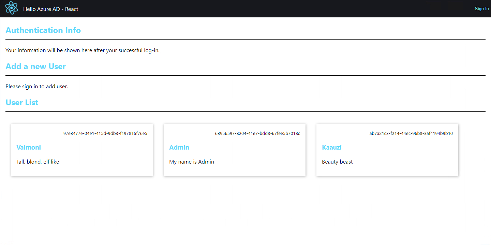
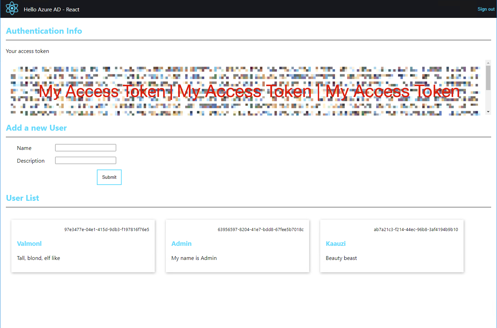

# Hello Azure AD - React

Example web SPA powered by React. Authenticate to Azure Active Directory, and perform API calls to protected endpoints of the server under the same Azure AD app.

This project was bootstrapped with [Create React App][createReactApp].

The project uses [pnpm package manager][pnpm].

## Prerequisites

A working Azure AD. If you do not have one, please follow [Configuration on Azure portal][configureAzurePortal]

An App server.

It should providing the following endpoints:

- GET Ready State (e.g. `/api`) 
- GET User List (e.g. `/api/user`)
- POST Add Users (Under Azure AD access control) (e.g. `/api/user/add`) 

Note: endpoint path is not necessarily the same. They are provided later by you in the env variable.

It should have this schema for User object:

``` ts
export interface IUser {
  id: string;
  name: string;
  description: string;
}

export interface IInputUser {
  name?: string;
  description?: string;
}
```

## Get started

- Clone `.env` file in project root folder, and name it `.env.local`. Provide information of your Azure AD (`Hello Azure AD => App registrations => (Your app name) => Overview`).
  - REACT_APP_AUTH_CLIENT_ID

    Use `Application (client) ID`

  - REACT_APP_AUTH_AUTHORITY

    `https://login.microsoftonline.com/(Replace with Directory (tenant) ID)`

  - REACT_APP_AUTH_REDIRECT_URI

    Anything will do. e.g. `http://localhost:3031`

  - REACT_APP_AUTH_SCOPES

    When on the App page, go to the `Expose an API` section, and copy the scope you created.

    It should look like `api://---GUID---/scopeName`

    If you have multiple scopes, separate them with commas without space in between.

  - REACT_APP_API_BASE_URL

    Your app server "Ready State" endpoint.

  - REACT_APP_API_GET_USER_URL

    Your app server endpoint to get the user list.

  - REACT_APP_API_ADD_USER_URL

    Your app server endpoint to add new users.

- Run `pnpm install` to get node modules.

- Start the app. You have 3 plans

  - start the dev server and your app server individually.

    Easier, but your app server must allow CORS.

  - (Or) build this client and serve by your app server.

    You need to have some knowledge about how your app server serves static resources.

  - (Or) build this client and serve by a static resource server (e.g. Nginx) or a CDN.

    More difficult, but whatever floats your boat.

- Go to the app home page.

- When not logged in, the top right Sign-in button shows up. You cannot see your auth token, nor the add user form, but you can see the user list if there are data available.



- After clicking the Sign In button, a standard Microsoft log-in window pops up. Before really entering your credentials, please drag this window outside the main browser window. (To prevent the browser-in-the-browser attack if you don't trust me 🙂. It is a genius means of cyber attack very popular at the time of writing).

- Enter your Microsoft name and password, and authorize.

- After successful login, the sign-in button becomes the sign-out button. You now have a token displayed in the "Authentication Info" section. The form to add a user is also displayed.



- Provide a new user name and description, and hit the Submit button. After a while, a new user card will be created in the "User List" section.

- Click the Sign Out button, and the sign-out window pops up. After properly signing out, your token disappears, and you can no longer see the add user form.

## Behind the scene

The authentication is managed by the `msal` library. The sign-in/out button on the nav bar, defined in `App.tsx`, when clicked, launches pop-up windows. It modifies the Msal instance at the end of the operation.

``` ts
  const onSignInButtonClick = async (e: MouseEvent) => {
    await instance.loginPopup(loginRequest);
  };

  const onSignOutButtonClick = async (e: MouseEvent) => {
    await instance.logoutPopup();
  };
```

If the login/out is a success, then the component is updated. If the user is authenticated, the token is grabbed from cache or Azure AD. If the token is expired, it also logs you out and asks you to re-sign in. On the other hand, if the user is logged out, then the token is removed. The behavior happens in a `useEffect` hook in `App.tsx`.

``` ts
  const requestAccessToken = async () => {
    const request: SilentRequest;

    try {
      const response = await instance.acquireTokenSilent(request);
      setAccessToken(response.accessToken);
    } catch (error) {
      const response = await instance.acquireTokenPopup(request);
      setAccessToken(response.accessToken);
    }

  };

  useEffect(() => {

    if (isAuthenticated) {
      requestAccessToken();
    } else {
      if (accessToken) {
        setAccessToken("");
      }
    }

  }, []);
```

The token is displayed on the page for demonstration purposes. It is the Bearer token used when calling POST requests on "add User" endpoint.

## Side note - Axios hook

A custom hook performing API calls is created, with a flavor inspired by [Apollo Client GraphQL library][apolloClient].

It uses [Axios][axios] as the main backing tool to send out requests.

In `src/services/DataAccess.tsx`:

`useAxiosQuery()` is meant to perform "GET" requests. It performs query immediately once used. The result is stored in the `data` value.

`useAxiosMutation()` is created to call "POST", "PUT", "PATCH", "DELETE" operations. Unlike `useAxiosQuery()`, you need to call the returned `execute` method explicitly after use.

The User data in this app are retrieved from the server only once and then cached. The "Adding user" method sends out POST calls and updates the cache locally. No subsequent queries are performed.

## Refs

https://docs.microsoft.com/en-us/azure/active-directory/develop/tutorial-v2-react

<!-- Links -->
[createReactApp]: https://github.com/facebook/create-react-app
[pnpm]: https://pnpm.io/
[configureAzurePortal]: https://github.com/longyiszh/hello-azure-ad/tree/main/server/dotnet#configuration-on-azure-portal
[apolloClient]: https://www.apollographql.com/docs/react/api/react/hooks
[axios]: https://axios-http.com/